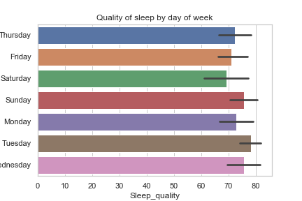
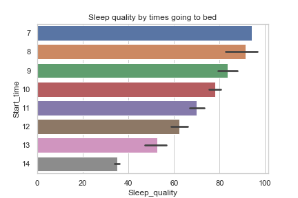
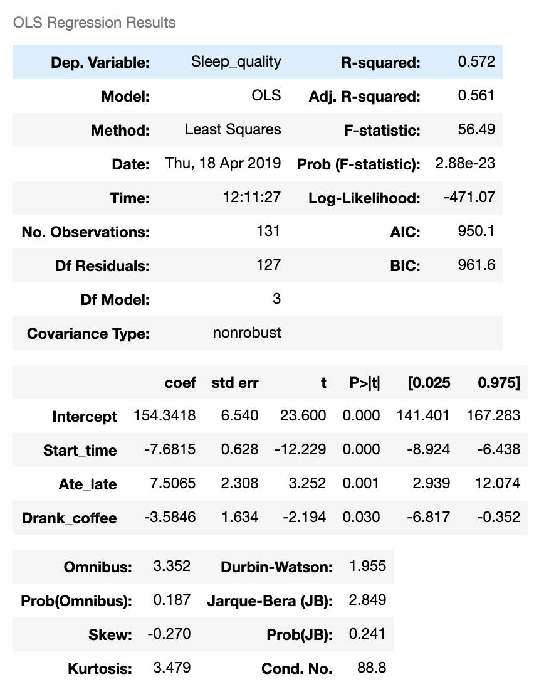
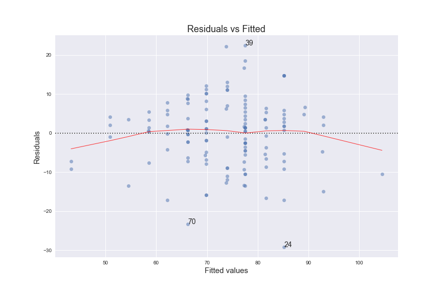
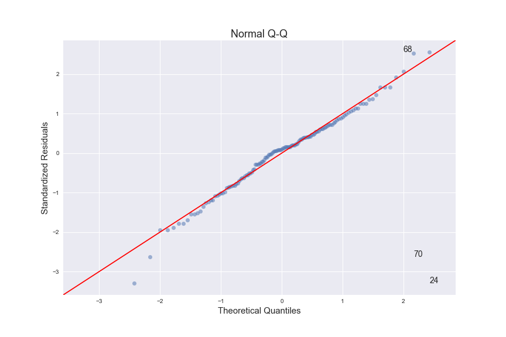

# Sleep_Quality
An attempt to understand under what conditions I sleep better via application of statistical techniques and linear models

# Question I am trying to answer
Which of my daily activities are ascociated with better sleep quality?

# Target variable
Sleep quality index

# How is Sleep Quality calculated? 
Sleep quality is based on four measurements:
1. Amount of time spent in bed.
2. Amount of time spent in deep sleep.
3. Consistency of the sleep.
4. Amount of times where the app registered you as fully awake. (Sleepcycle, 2019)

# Data scource
Data is collected from the Sleep Cycle app 
Sleep Cycle app uses the accelerometer inside my iPhone to detect movements during sleep and detects patterns

# Variables:
* Sleep_quality	
* Time_in_bed	
* Activity_steps	
* Start_time	
* Ate_late	
* Drank_coffee	
* Stressful_day

# EDA takeaways
Analysis revealed interesting patterns based on the date of week:
 
Overall, confirms intuition but good Tuesday's quality is a surprise 
Always thought that Sunday sleep was bad, but data showed otherwise

 
Going to bed earlier seems to be associated with better sleep quality
However, start time is related to duration of sleep, which is used to calculate the index.

# Hypothesis testing
QUestions asked:
Is my sleep quality worse than the average sleep quality?
Is my sleep duration is less than the average sleep duration?

Failed to reject the null hypothesis (avarage reported = my avarage) in both cases

# Multivariable regression
 

Residuals plotted Residuals_vs_Fitted.png
 

QQplot testing
 

# Takeaways
Results are inconclusive becasue predictors are most likely biased
Need to get more data
Improve model specifications (get more variables and understand relationship between them better)

# References:
https://support.sleepcycle.com/hc/en-us/articles/206704659-How-is-Sleep-Quality-calculated-
